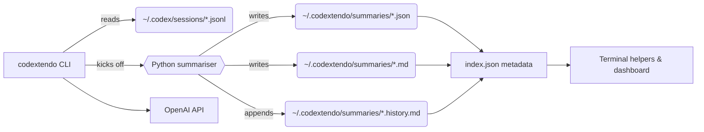

<div align="center">

# Codextendo

_Resume Codex CLI conversations in one keystroke, keep institutional memory in sync, and share it across terminals or the web._

[](#install--first-run)
[](#requirements)
[](./LICENSE)
[](https://github.com/BranchManager69/codextendo/pulls)

</div>

---

## Quick Navigation
- [Why Codextendo](#why-codextendo)
- [Requirements](#requirements)
- [Install & First Run](#install--first-run)
- [How It Works](#how-it-works)
- [Workflows](#workflows)
- [Configuration Cheat Sheet](#configuration-cheat-sheet)
- [Cost & Model Controls](#cost--model-controls)
- [Data & Security](#data--security)
- [Troubleshooting & FAQ](#troubleshooting--faq)
- [Dashboard](#dashboard)
- [Contributing](#contributing)
- [Keeping Up To Date](#keeping-up-to-date)
- [License](#license)

## Why Codextendo
Codextendo stitches together the Codex CLI transcripts you already generate and turns them into resumable conversations, rich summaries, and dashboards. Instead of scrolling through JSONL files, you can:
- jump back into the right session in one command
- leave breadcrumbs for teammates via structured summaries and history timelines
- review everything from a browser-friendly dashboard backed by the same data

## Requirements
- Bash or a compatible shell that can source Bash functions
- Python 3.9+
- [`jq`](https://stedolan.github.io/jq/) for JSON parsing
- [`requests`](https://pypi.org/project/requests/) for API calls
- [`tiktoken`](https://pypi.org/project/tiktoken/) *(optional – precise token counts)*
- `OPENAI_API_KEY` exported in the environment for summarisation commands

## Install & First Run
1. Clone and install the helpers:
   ```bash
   cd ~/tools
   git clone https://github.com/BranchManager69/codextendo.git
   cd codextendo
   ./install.sh
   ```
2. Reload your shell so the new functions and config helpers take effect:
   ```bash
   source ~/.bashrc   # or open a new terminal
   ```
3. Try resuming a recent conversation:
   ```bash
   codextendo "missing greetings"
   ```
   Select a result by number, and Codextendo reopens the session while prompting the assistant for a Past/Present/Future recap so you can restart with context.

> Tip: Codextendo ships shell helpers, a Python summariser, and a lightweight config/pricing layer. Rerun `./install.sh` any time after updating the repo to refresh `~/.codextendo/`.

## How It Works
Codextendo keeps minimal state on disk and leans on your existing Codex transcripts. Preferences such as the default summariser model or UI options live in `~/.codextendo/config.json`, which both the CLI and dashboard read unless you override them via environment variables.



### Search & Resume
- `codextendo <query>` fuzzy-searches Codex sessions, shows the newest matches, and resumes the one you pick.
- The helper sends a recap message (customisable) so the assistant can tell you Past/Present/Future in one response.

### Summaries & History
- `codextendo --summary` (or `--summarize`) creates Markdown + JSON summaries and appends a timeline entry to `<session>.history.md`.
- `codextendo refresh` walks every transcript, reuses cached hashes to skip unchanged files, and updates `index.json` for fast lookup.

### Indexing & Sharing
- All summaries land in `~/.codextendo/summaries/` along with `index.json`, enabling instant lookups by CLI helpers or the optional Next.js dashboard.
- Set `CODEXTENDO_SUMMARY_DIR` to point the CLI and dashboard at a shared location (e.g., synced storage).

## Workflows
### 1. Resume in seconds
- **When:** you just jumped back into a terminal and need the right conversation fast.
- **Command:**
  ```bash
  codextendo "enable transcript logs"
  ```
- **What you get:** fuzzy-matched sessions, a numeric picker, automatic recap prompt, and the Codex CLI resumes where you left off.
- **Follow-up:** export the session with `codexopen <index> --dest ~/codex-replay` if you need the raw JSONL later.

### 2. Produce a shareable brief
- **When:** you want clean notes for teammates or to close out a task.
- **Command:**
  ```bash
  codextendo --summarize "branch manager onboarding"
  ```
- **What you get:** `<session>.json`, `<session>.md`, and `<session>.history.md` in the summary directory, each stamped with model, token counts, highlights, concerns, and next steps.
- **Follow-up:** share the Markdown file or let the dashboard pick it up automatically.

### 3. Rebuild everything nightly
- **When:** you need summaries to stay fresh without manual runs.
- **Command:**
  ```bash
  codextendo refresh --limit 50
  ```
- **What you get:** the newest N transcripts reprocessed, cache-aware skipping for untouched sessions, and an updated `index.json`.
- **Follow-up:** add the command to cron/launchd; combine with `--force` if you want a full rebuild (e.g., after template changes). The dashboard’s Bulk Summarize card shows the same progress if you prefer to launch runs there.

### 4. Forecast bulk costs before you run
- **When:** you want to sanity-check spend or pick a cheaper model before kicking off a refresh.
- **Where:** open the dashboard sidebar, expand **Bulk Summarize**, and review the live token stats + estimated prompt/completion dollars pulled from the bundled pricing catalogue.
- **What you get:** a dropdown of supported models, clarity on how many sessions still lack recorded usage, and projected costs for the pending run versus the entire dataset.
- **Follow-up:** adjust the model (unless `CODEXTENDO_SUMMARY_MODEL` locks one in place) and launch the run once the forecast looks right.

### 5. Browse in the dashboard
- **When:** you prefer a UI to scan sessions, filter by labels, or demonstrate history.
- **Commands:**
  ```bash
  cd dashboard
  npm install
  npm run dev
  ```
- **What you get:** a Next.js app on `http://localhost:3000` that groups conversations by project (derived from their cwd) and lets you drill into each session summary.
- **Follow-up:** run `npm run build && npm run start` for production and point `CODEXTENDO_SUMMARY_DIR` wherever the summaries live in prod.

### 6. Audit session sizes before a refresh
- **When:** you need to understand how many tokens (≈ words/pages) each conversation will feed to the summariser.
- **Command:**
  ```bash
  codextendo session-sizes --details --limit 15
  ```
- **What you get:** per-session kept tokens, word/page estimates, truncation flags, and (with `--details`) a payload breakdown between real dialogue and tool noise.
- **Follow-up:** trim noisy transcripts, lower token limits, or chunk long conversations before kicking off an expensive refresh.

- **Need machine-readable data?** Add `--json` (and `--session <id>` to focus on one run) to emit structured metrics, including reachback timestamps and transcript totals. Example:
  ```bash
  codextendo session-sizes --session 01998964-b3c1-7b23-8335-1414db4c323f --details --thresholds --json
  ```

### 7. Page through the raw transcript
- **When:** you want to read the conversation itself (not just summaries) without opening the JSONL manually.
- **Command:**
  ```bash
  codextendo transcript --session 01998964-b3c1-7b23-8335-1414db4c323f --page 1 --page-size 200 --json
  ```
- **What you get:** newest segments with timestamps, payload type, text, and optional token counts. Increase `--page` to fetch older slices, or add `--order oldest` to read from the beginning. Drop `--json` for a quick textual preview.

## Configuration Cheat Sheet
| Setting | Default | Purpose | Change it when |
| --- | --- | --- | --- |
| `CODEXTENDO_SUMMARY_MODEL` | `gpt-5` | Preferred summariser model (wins over config/UI choices). | You need a fixed model for policy/compliance or want a cheaper/faster option. |
| `CODEXTENDO_SUMMARY_TOKEN_LIMIT` | `200000` | Upper bound on transcript tokens passed to the summariser. | Sessions exceed the limit or you want to cap API usage. |
| `CODEXTENDO_SUMMARY_DIR` | `~/.codextendo/summaries` | Destination for summaries, history, and `index.json`. | Storing output on shared or remote storage, or pointing the dashboard elsewhere. |
| `CODEX_LABEL_FILE` | `~/.codex/search_labels.json` | Where session labels are persisted. | Coordinating labels with teammates or keeping them in repo-controlled storage. |
| `CODEXTENDO_RESUME_PROMPT` | rich Past/Present/Future prompt | Default catch-up message sent on resume. | You want a different onboarding prompt. |
| `CODEXTENDO_RESUME_PROMPT_DISABLED` | unset | Disables the automatic recap entirely. | You have your own recap flow or don’t want Codex to speak first. |
| `codextendo --summary-dir PATH` | inherits from env | CLI override for summary location. | Ad-hoc runs to a temporary directory. |
| `codextendo --sessions-dir PATH` | `~/.codex/sessions` | Source of Codex transcripts. | Codex stores transcripts somewhere else or you are replaying archived sessions. |
| `codextendo refresh --force` | off | Rebuild every summary ignoring cache. | You updated templates or fixed a summariser bug. |
| `~/.codextendo/config.json` | auto-created | Persisted preferences (e.g., summariser model) shared by CLI + dashboard. | Use the dashboard to edit, or tweak manually when you need durable defaults without env vars. |

Environment variables always override the config file; rely on them for temporary overrides or when you must enforce a global policy.

## Cost & Model Controls
- Codextendo ships OpenAI’s model pricing catalogue at `resources/pricing/openai_api_model_pricing.json`; `./install.sh` mirrors it to `~/.codextendo/resources/pricing/` for runtime use.
- The dashboard’s **Bulk Summarize** card reads the catalogue, loads token stats, and estimates the prompt/completion cost for both pending work and the full dataset before you press run.
- Use the same card to pick a different summariser model. Your choice is saved to `~/.codextendo/config.json` so future CLI jobs honour it. Set `CODEXTENDO_SUMMARY_MODEL` when you need to enforce a specific deployment.
- Automations can load the pricing file via `tools/codextendo/pricing.py` or hit the dashboard’s `/api/cost-estimate` endpoint. The schema is documented in [`OPENAI_PRICING_SCHEMA.md`](./OPENAI_PRICING_SCHEMA.md).

## Data & Security
- **Stored artefacts:** Codex transcripts stay in `~/.codex/sessions/`; Codextendo writes summaries, Markdown, history logs, and `index.json` under `~/.codextendo/summaries/` (or your configured directory).
- **Config & logs:** `~/.codextendo/config.json` holds persisted preferences, and long-running refreshes stream into `~/.codextendo/logs/refresh-*.log`. Delete them if you need to reset preferences or purge history.
- **Retention:** delete a session by removing the transcript (`~/.codex/sessions/<id>.jsonl`) and associated summary files. Re-run `codextendo refresh` to clean up `index.json`.
- **Redaction:** sanitise transcripts before sharing by editing the JSONL files or by post-processing the Markdown summaries. The helper does no automatic PII scrubbing.
- **Credentials:** summarisation calls the OpenAI API using `OPENAI_API_KEY`; keep the key exported in your shell and rotate it per your organisation’s policy.
- **Network footprint:** only the summariser hits external APIs. Resume flows operate on local transcripts, so you can use Codextendo while offline as long as summaries already exist.

## Troubleshooting & FAQ
- **Picker prompt missing:** reload your shell (`source ~/.bashrc`) after reinstalling. The prompt writes to `/dev/tty`, so it will not appear in captured transcripts even when working.
- **`ModuleNotFoundError: tiktoken`:** install optional dependencies with `pip install -r requirements.txt` (or `pip install tiktoken requests`). Summaries still run without `tiktoken`, but token counts fall back to estimates.
- **`OPENAI_API_KEY` not set:** export the key before running summary commands, or set it in your shell profile.
- **Stale summaries after editing transcripts:** run `codextendo refresh --force` to rebuild everything and regenerate `index.json`.
- **Dashboard not showing new sessions:** confirm it points at the same `CODEXTENDO_SUMMARY_DIR` and restart after big rebuilds to bust Next.js file caches.

## Dashboard
- The dashboard now ships in-repo at `dashboard/` and reads `index.json` plus all JSON summaries from `CODEXTENDO_SUMMARY_DIR`.
- For development: `cd dashboard && npm install && npm run dev` to launch `http://localhost:3000` with hot reloads.
- For production: `npm run build && npm run start`, optionally with `PORT` / `HOST`. Deploy under PM2, systemd, or any Node process manager.
- Remote/staging data: set `CODEXTENDO_SUMMARY_DIR` (or `.env.local`) to point at a mounted drive, S3 sync folder, or shared volume. All paths resolve via Node, so absolute and `~/` locations both work.
- Sessions are grouped by project (derived from the stored cwd). Use `codextendo metadata` to backfill cwd metadata into existing summaries without spending tokens.
- Session cards show cwd, latest activity, token counts, and provide `codex://` resume links so you can hop straight back into the CLI.

## Contributing
Open issues or pull requests if you have ideas for new workflows, integrations, or documentation upgrades. The helper scripts are Bash and Python; the dashboard is Next.js. Please run `./install.sh` after local changes to verify the installed copy stays in sync.

## Keeping Up To Date
- Pull the latest changes and reinstall:
  ```bash
  cd ~/tools/codextendo
  git pull
  ./install.sh
  source ~/.bashrc
  ```

## License
MIT
